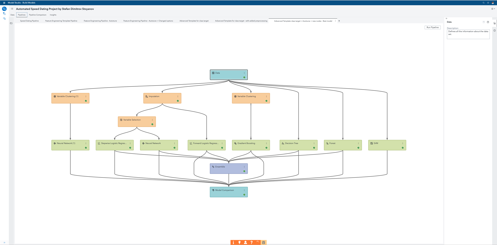
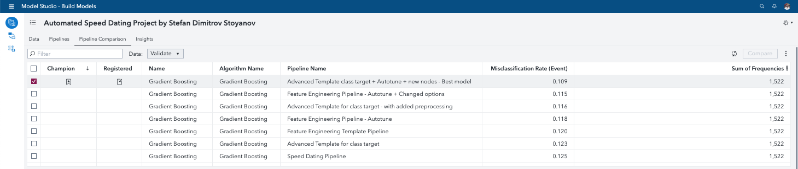
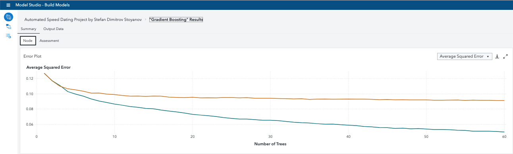
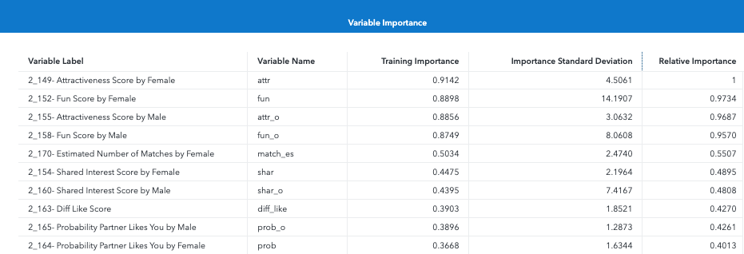

# My Best Prediction of Love at First Sight

I succeeded to build a machine learning model that was 1.85% more accurate than the model champion presented in the free trial script.

Commonly, Validation Misclassification is used for binary responses and smaller data. Therefore, the best performing model for this project is determined based on the Validation Misclassification Rate (Event).

My Gradient Boosting model performed the best with a Validation Misclassification Rate (Event) of 0.1091. That is, only in 10.91% of the cases the model made wrong predictions. For 89.09 % of the speed dates, the model correctly predicted if there was a match or not.

Champion model is a **Gradient Boosting** model with the following assessment parameters:

- **Validation Misclassification Rate (Event): 0.1091**
- Validation KS: 0.5679

The pipeline is based on the prebuilt Advanced Template for Class Target, from the Exchange tool of SAS Viya in Model Studio. I set up some of the options and used the autotuning feature to improve the performance of the models in the pipeline. I applied the interpretability feature of SAS Viya. It includes the Input Relative Importance table, The Partial Dependence (PD) plot, the Individual Conditional Expectation (ICE) plot, and the Local Interpretable Mode-Agnostic Explanations (LIME) plot. They visualise the relationship between the input variables and the target variable. Besides, the Input Relative Importance table presents the most important predictors in the model.  I also tried different combinations of preprocessing nodes along with the Imputation and Variable Selection nodes, which were part of the pipeline template. However, the most significant effect on the models’ performance had the Variable Clustering node. Therefore, from the new nodes I tried, I left only the Variable Clustering node in the final pipeline. This made the analytical workflow simpler and saved computational resources and time when I ran it.

The pipeline includes the following type of nodes (apart from the Data and Model Comparison nodes):

1.  Data Mining Preprocessing tasks:

- Imputation
- Variable Selection
- Variable Clustering

2.  Supervised Learning models:
- Decision Tree
- Forest
- Gradient Boosting
- Forward Logistic Regression
- Stepwise Logistic Regression
- SVM
- Neural Network
- Ensemble

I also created some more pipelines, based on the pipelines from the SAS Viya VDMML free trial. I adjusted some of the options of the models, added other data mining preprocessing nodes to the pipelines. I also used the unique SAS Viya autotune feature. It saved me so much time searching for the optimal parameters!

Then, I used the Pipeline Comparison feature of SAS Viya to automatically identify the Champion model across all pipelines in my project.

From the champion model, we see that the top 10 predictors in determining a match are:

1.  Attractiveness Score by Female,
1.  Fun Score by Female,
1.  Attractiveness Score by Male,
1.  Fun Score by Male,
1.  Estimated Number of Matches by Female,
1.  Shared Interest Score by Female,
1.  Shared Interest Score by Male,
1.  Diff Like Score,
1.  Probability Partner Likes You by Male, and
1.  Probability Partner Likes You by Female.

- One of the essential factors influencing love at first sight are fun, attractiveness and shared interests.
- However, here, we can see some fascinating predictors. "Probability Partner Likes You by Female" represents how a female thought the male would score them on the overall like score. Likewise, "Probability Partner Likes You by Male" represents how a male thought the female would score them on the overall like score. That is, how much we think our date liked us is a significant catalyst for our feelings of 'love at first sight'.
- After the speed dates, each partner gave an overall "how much did you like the person" score. "Diff Like Score" is the difference between the two scores. For example, if the male gave the female an overall like score of 8 and the Female gave an overall like score of 7, then this variable would be 1 (8-7). We can see that according to the model if there was no significant difference in the way two partners liked each other, the couple was more likely to make a match.
- Based on the predictor “Estimated Number of Matches by Female”, we can also see that if a female believed she was going to make a match, it was more likely to happen.

Get better prepared for your next date. Beat my best predictive model! 

If you do, you can try building new models to see if you can create a model which is more accurate (generates a lower misclassification rate) and provides better predictors of love at first sight. Download the model code and upload it to the SAS Viya Trials Challenge GitHub repository. In this way, you will showcase the machine learning expertise you will build by walking through the SAS® Visual Data Mining and Machine Learning on SAS® Viya free trial.

By building your model predicting the influencers of love at first sight, you will get better prepared for your next date, just like me. :) Even you have already found the love, you can become a mentor to all your single friends in their attempts to find THE ONE.

Sign up for the free trial and come one step closer to true love. :)

Here you can see the pipeline with the champion model:

Here you can see some details about my champion model results:

 

